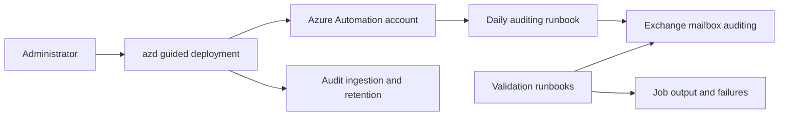

# Advanced auditing for Microsoft 365

Deploy Azure Automation runbooks that configure and continuously validate advanced Microsoft 365 and Exchange Online auditing.

This template helps an administrator:

- enable unified audit-log ingestion when needed;
- create a one-year all-record-types retention policy when the current Security & Compliance connection supports it;
- configure the expected admin, delegate, and owner mailbox-audit actions;
- detect mailbox audit-bypass associations;
- run the checks daily through an Azure Automation managed identity.

> This deployment changes tenant-wide audit ingestion, retention, Exchange permissions, and mailbox auditing. The current PowerShell 7.6 and ExchangeOnlineManagement 3.10.1 combination still needs an authorized end-to-end retest; review [the known validation gap](docs/technical-reference.md#supported-platform-retest) before production use.

## Quickstart

Install [Azure Developer CLI](https://learn.microsoft.com/azure/developer/azure-developer-cli/install-azd), Azure CLI, and PowerShell 7. Use an administrator who can deploy Azure Automation, consent to the required Graph permissions, and configure Exchange and Purview auditing.

From a new empty directory, run:

```powershell
azd init -t nathanmcnulty/azd-advanced-auditing && azd up
```

The hooks reuse normal cached or browser authentication. The deployment installs ExchangeOnlineManagement 3.10.1 or later for the current user when needed; administrators do not need Node.js or a local application build toolchain.

## What gets deployed



The Azure deployment creates an Automation account, a PowerShell 7.6 runtime, three runbooks, a daily schedule, and configuration variables. The post-provision hook grants the managed identity limited Exchange authority, publishes the actual runbooks, runs remediation, and validates the resulting state.

## Permissions and behavior

The administrator needs Azure deployment and role-assignment authority, Exchange access sufficient to create the service-principal link and limited management role, and delegated Graph consent for `Application.Read.All`, `AppRoleAssignment.ReadWrite.All`, and `Domain.Read.All`.

If Security & Compliance PowerShell authentication is unavailable, the deployment reports a degraded warning and identifies the retention policy that requires manual completion. Mailbox remediation or validation failures remain fatal.

## Verify the deployment

After `azd up`:

1. Confirm all three runbooks were published and the daily schedule is linked.
2. Confirm managed-identity Exchange validation succeeded.
3. Review the remediation and full mailbox-validation job output.
4. Resolve every reported mailbox audit-bypass association.
5. Verify unified audit ingestion and the effective retention policy for the licenses in scope.

Do not interpret a successful infrastructure deployment as proof that the currently documented Exchange module/runtime combination has passed the outstanding live retest.

## Documentation

| Guide | Use it for |
| --- | --- |
| [Technical reference](docs/technical-reference.md) | Components, coverage, permissions, implementation, validation, and the live retest gap |
| [Operations](docs/operations.md) | Verification, degraded retention handling, reruns, and cleanup |
| [Development](docs/development.md) | Repository layout, tests, generated Bicep, and catalog publication |
| [Agent-assisted deployment](docs/agent-assisted-deployment.md) | Safe administrator and agent authority boundaries |

## Cleanup

Run:

```powershell
azd down --purge
```

The pre-down hook removes the template's Automation delete lock so Azure resources can be deleted. Tenant audit settings, retention policies, Exchange service-principal links, roles, and role groups are not automatically reverted. Inventory and remove them separately only with explicit administrator approval.

This work rebuilds the solution described in the [advanced auditing guide](https://nathanmcnulty.com/blog/2025/04/comprehensive-guide-to-configuring-advanced-auditing/) and is released under this repository's license.
